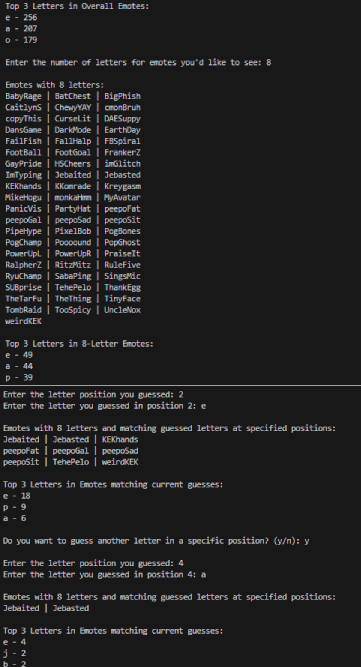
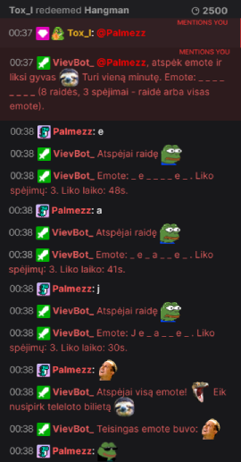

# Twitch Hangman Guesser

## Project Overview

This project is a Python bot designed to help Twitch users identify the correct emote after being "*hangmanned*" in chat. 
The bot filters Twitch emotes based on length and specific letter positions, assisting users in narrowing down potential matches.

<table>
    <tr>
         <td></td>
         <td></td>       
    </tr>
</table>

## Features

- Fetching global Twitch emotes and merging them with custom emotes;
- Filtering emotes by letter count and specific positions;
- Showing the top 3 most frequent letters in the emote set;
- Helping users narrow down emote options during hangman game.

## Technologies Used

- **Python**: For building the bot and filtering emotes;
- **Twitch API**: For fetching emotes.

## Setup and Installation

1. Clone this repository:
   `git clone https://github.com/A-Kederys/Twitch-hangman-guesser.git`
2. Navigate to the project directory;
3. Install required dependencies:
   - `pip install requests`
   - `pip install python-dotenv`
4. Set up your Twitch API credentials:
   - Generate a **Client ID** from [Twitch Token Generator](https://twitchtokengenerator.com/);
   - Generate an **OAuth Token** from [Twitch Apps](https://twitchapps.com/tmi/);
   - Add your generated credentials to the `.env` file.
5. (Optional) Add any desired emotes you want to include, in `custom_emotes.txt`, one per line;
6. Run the bot.

## How to Use

1. Open desired Twitch chat, where hangman game exists;
2. When "*hangmanned*", do the following:
   - Enter the number of letters in the emote;
   - Provide any guessed letters and their positions.
3. The bot will display potential emotes based on your input;
4. Continue refining your input until the correct emote is found.
